\newpage

## Introducción

El objetivo de este trabajo práctico es evaluar los distintos hiperparámetros encontrados durante el entrenamiento de una red neuronal, evaluarlos y elegir el conjunto de parámetros más óptimos. En el marco de este trabajo práctico, se realizará un clasificador de imágenes CIFAR-10, la cual contiene imágenes de pájaros, gatos, venados, perros, ranas, caballos, barcos y camiones.

## Dataset

El dataset CIFAR-10 contiene 60000 imágenes de 32x32 pixeles, divididas en 10 clases distintas. El conjunto de entrenamiento contiene 50000 imágenes y el conjunto de evaluación 10000 imágenes. Las clases son mutuamente excluyentes y corresponden a las siguientes categorías:

-   plane
-   car
-   bird
-   cat
-   deer
-   dog
-   frog
-   horse
-   ship
-   truck

De las 50000 imágenes del conjunto de entrenamiento, separamos 10000 para el conjunto de validación.

## Configuración

Comenzamos importando las librerías necesarias para el desarrollo del trabajo práctico. Luego creamos una cuenta en Weights & Biases para poder utilizarla como herramienta de análisis de los resultados obtenidos. Por último, importamos el dataset CIFAR-10 de TorchVision lo dividimos en los conjuntos de entrenamiento, validación y evaluación con la librería de pytorch.

Como contamos con procesadores ARM M1, el backend para correr con la GPU es Metal, por lo que configuramos el dispositivo a MPS para evaluar en nuestras computadoras. 

Ademas para entrenamientos mas intensivos en un comienzo utilizamos la GPU T4 de Google Colab, pero nos era poco práctico, por lo que nos conectamos de forma remota en una computadora de escritorio con una GPU 1080 Ti con 8GB de VRAM y 16GB de RAM para entrenar los modelos. Salvo por InceptionNet, todos los modelos fueron primero corridos con el backend MPS y luego entrenados con CUDA.

\newpage

## Arquitecturas de Redes Neuronales

Realizamos 3 arquitecturas distintas de redes neuronales, con distintas cantidades de capas ocultas y distintas cantidades de neuronas por capa. Para cada una de ellas, variamos la cantidad de capas ocultas y la cantidad de neuronas por capa. Para cada una de estas combinaciones, realizamos 3 corridas distintas, para poder obtener un promedio de los resultados obtenidos (Las imágenes con las arquitecturas se encuentran anexadas al final del documento).

### Arquitectura Base:

Para comparar las arquitecturas que implementamos, partimos de la arquitectura base que vino con la consigna del trabajo práctico.

### Arquitectura 1: Softmax Dropout Relu LeakyRelu

La primera arquitectura que decidimos hacer la llamamos Softmax Dropout Relu LeakyRelu, ya que cuenta con una capa de salida Softmax y el resto de las capas con función de activación Relu y LeakyRelu. Esta arquitectura cuenta con 1 capa de entrada, 8 capas ocultas y una de salida. Ademas de las funciones de activación, se utilizan dropouts (2 veces) con una probabilidad del 0.2 para mitigar el overfitting. La arquitectura de la red se puede visualizar en el anexo. Esta fue la mejor de las 3 arquitecturas que implementamos.


### Arquitectura 2: LeakyRelu Dropout

Esta arquitectura la llamamos LeakyRelu Dropout. Cuenta con dropouts (5 veces) con una probabilidad del 0.4 para mitigar el sobre-ajuste y la única función de activación empleada es LeakyRelu. El proceso culmina en una capa de salida, con una activación log-softmax para producir probabilidades de clase. En total, la arquitectura consta de 1 capa de entrada, 9 capas ocultas y 1 capa de salida. Esta fue la peor de las 3 arquitecturas que implementamos.

### Arquitectura 3: Relu ELU LeakyRelu Dropout

Por último, usamos las red neuronal Relu ELU LeakyRelu, cuya estructura es similar a la segunda arquitectura, pero con una capa de entrada, 5 capas ocultas y una de salida. La diferencia es que en esta arquitectura se utilizan las funciones de activación Relu, ELU y LeakyRelu, pero, al igual que las demás, se utiliza la función de activación log-softmax en la capa de salida.

### Resultados de las arquitecturas

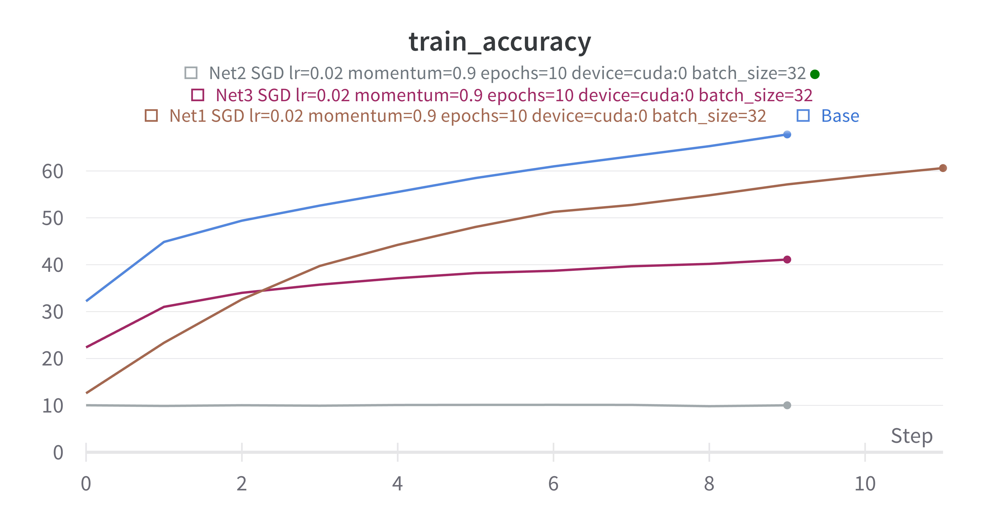
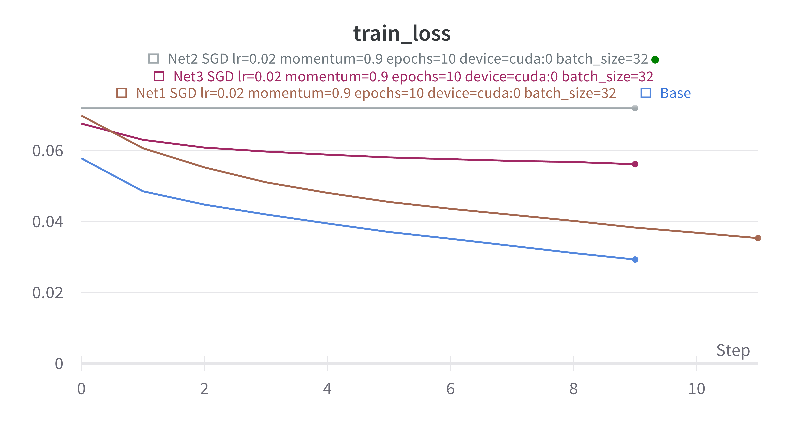
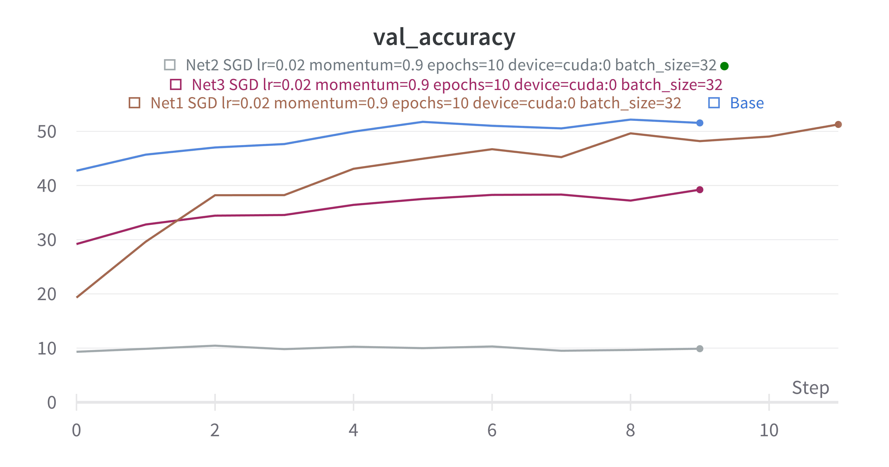
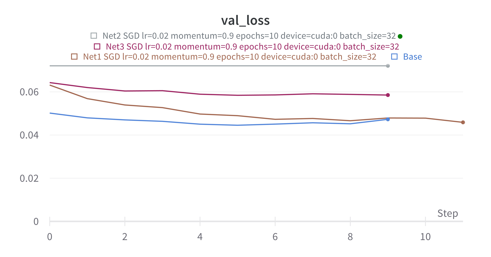

Ninguna de las 3 arquitecturas logró superar la performance de la arquitectura base sobre validación, aunque la primera estuvo muy cerca. Por lo que continuamos el desarrollo con Redes Neuronales Convolucionales.

\newpage

### Arquitecturas de Redes Neuronales Convolucionales

Implementamos 5 distintas CNNs para observar su comportamiento en el dataset CIFAR-10. Para cada una de ellas, variamos la cantidad de capas ocultas y la cantidad de neuronas por capa.

### Arquitectura 1: NetConv

Para la primera arquitectura, tomamos el ejemplo dado en clase y a partir del mismo comenzamos a modificarlo para adaptarlo al problema y obtener mejores resultados. Empezamos probando dropout como técnica de regularización y nos dimos cuenta que empeoraba. Luego, después de varias pruebas, decidimos utilizar LeakyReLu, a diferencia de ReLu, como única función de activación, ya que nos dio mejores resultados que las demás.

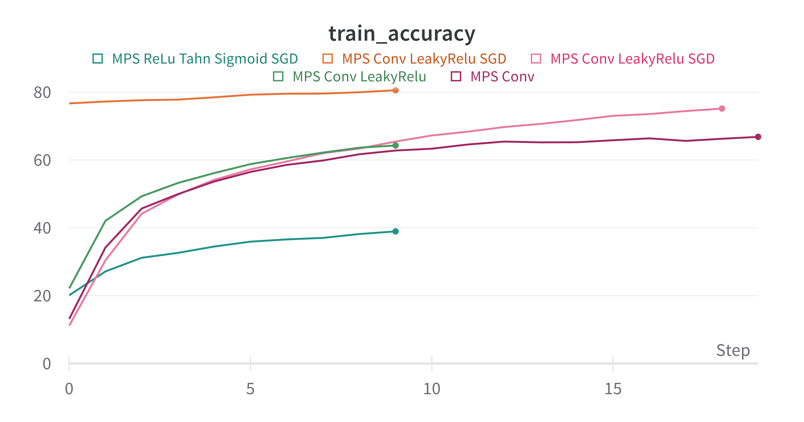
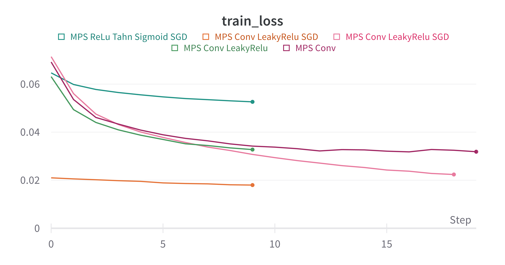
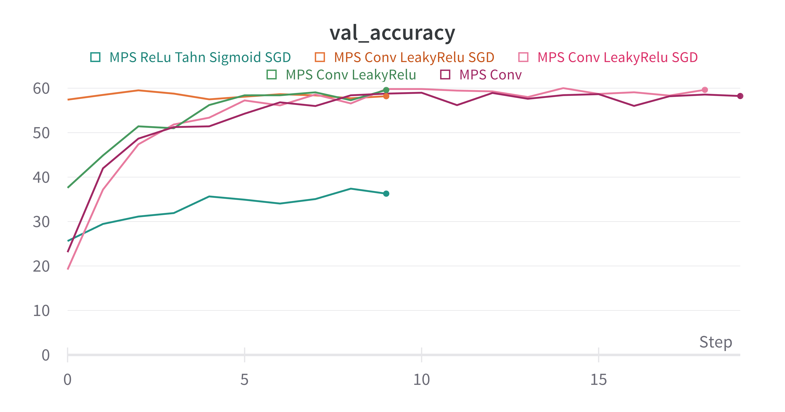
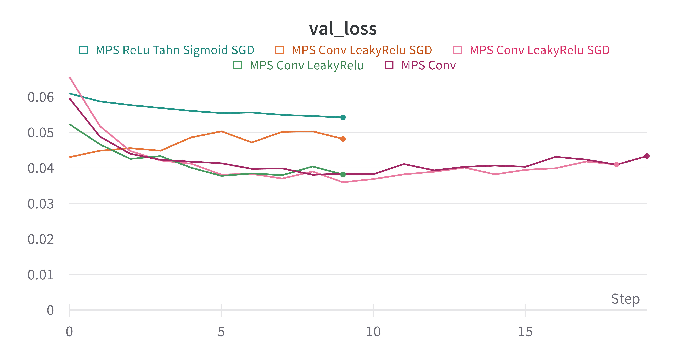

### Arquitecturas 2 y 3: VGG16 y VGG19

Para intentar mejorar los resultados obtenidos con la red neuronal convoluvional detallada en el inciso anterior, implementamos también dos arquitecturas de redes neuronales convolucionales de arquitectura VGG [@vgg_arxiv]. Una de ellas es VGG16 y la otra VGG19. Para pasar las imagenes por la red las debimos reescalar a 224x224 pixeles, ya que es el tamaño que requiere la arquitectura VGG. Aunque implementamos VGG19 no lo corrimos ya que rapidamente pasamos a evaluar sobre otras arquitecturas descriptas a continuacion. La implementación de VGG16 fue tomada de Paperspace [@vgg16].

La arquitectura de ambos modelos se encuentra detallada en el anexo.

### Arquitectura 4: InceptionNet

Como vimos en clase, la arquitectura InceptionNet [@inceptionnet_arxiv] es una red neuronal convolucional que tiene como objetivo mejorar la performance de la red reduciendo la cantidad de parámetros. Para lograr esto, la red utiliza filtros de distintos tamaños en la misma capa, y luego los concatena. Para este modelo obtuvimos la implementación de Kaggle [@inceptionnet].

El bloque Auxiliar del modelo utiliza el método `AdaptiveAvgPool2d` que para el backend MPS solo funciona cuando el tamaño de la entrada es múltiplo del tamaño de la salida, por lo que solo logramos correr InceptionNet usando el backend `CUDA` o corriendo en `CPU`.

La arquitectura del modelo InceptionNet se encuentra tambien detallada en el anexo.

### Arquitectura 5: ResNet

Al igual que las anteriores, la arquitectura ResNet [@resnet_arxiv] es una red neuronal convolucional que también vimos en clase. Esta red utiliza conexiones residuales para poder entrenar redes neuronales más profundas. Esto se logra sumando la entrada de una capa con la salida de la capa anterior. La implementación de este modelo la tomamos de Paperspace [@resnet].

La arquitectura del modelo ResNet que impelementamos se encuentra tambien detallada en el anexo.

\newpage

### Funciones de activación

Como mencionamos anteriormente, probamos distintas funciones de activacion. En partiuclar en la CNN, los mejores resultados los obtuvimos con la función LeakyRelu, mientras que los peores con la funcion Sigmoid. En cuanto a las redes neuronales, tuvimos los mismos resultados siendo la funcion LeakyRelu la mejor para clasificar las imagenes, y la funcion Sigmoid la peor.

### Optimizadores y Schedulers

Para todas las redes neuronalies utilizamos SGD. Evaluamos Adam para la Convolucional e InceptionNet pero sus resultados fueron mucho peores (al rededor del 10% de accuracy en validación) por lo que descartamos seguir evaluando con Adam. 

En cuanto a los schedulers, sobre nuestro mejor modelo probamos con StepLR y CosineAnnealingLR, StepLR empeoró drásticamente los resultados (14% de accuracy en validación) por lo que descartamos seguir evaluando con StepLR. CosineAnnealingLR logró buenos resultados pero no mejores que los que obtuvimos con el modelo sin scheduler.

### Regularizadores

Los regularizadores que utilizamos y sus resultados fueron los siguientes:

-   Dropout: Usamos Dropout en los primeros dos modelos (las red neuronal simple y la convucional) y en la convucional mostro mejoras mientras que en la simple no.
-   Batch Normalization: Lo utilizamos en todas las redes que implementamos y en todas mostro mejoras.
-   Data Augmentation: Implementamos con transofrmacions de pytorch las siguientes transformaciones: Voltear la imagen, rotar la imagen, aplicarle perspectiva y agregarle ruido de color. Sin embargo, en nuestras evaluaciones, empeoraba la performance de los modelos
-   Weight Decay (regularizacion L2): Es un hiperparametro que evaluamos sobre VGG16 y ResNet pero no mejoraron los resultados. 
-   Early Stopping: Esto lo implementamos a mano, viendo sobre los graficos que se generaron en Weights & Biases, cuando la loss de validacion comenzaba a crecer y en simultaneo veiamos como la accuracy mejoraba, identificabamos ese punto de inflexion como epoch maxima para entrenar ese modelo.

\newpage

### Resultados

Corrimos un total de 120 entrenamientos distintos, de los cuales 58 fueron ResNets (con su exploración de hiperparámetros), 16 InceptionNets, 16 VGG16, 17 ConvNets, 13 Redes Neuronales.

En los siguientes gráfico se puede observar la accuracy de validación y de entrenamiento a lo largo de los epochs de algunos de los mejores modelos de cada arquitectura:

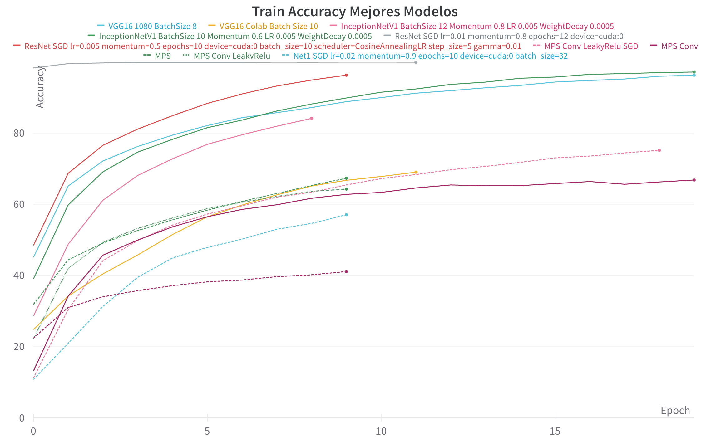
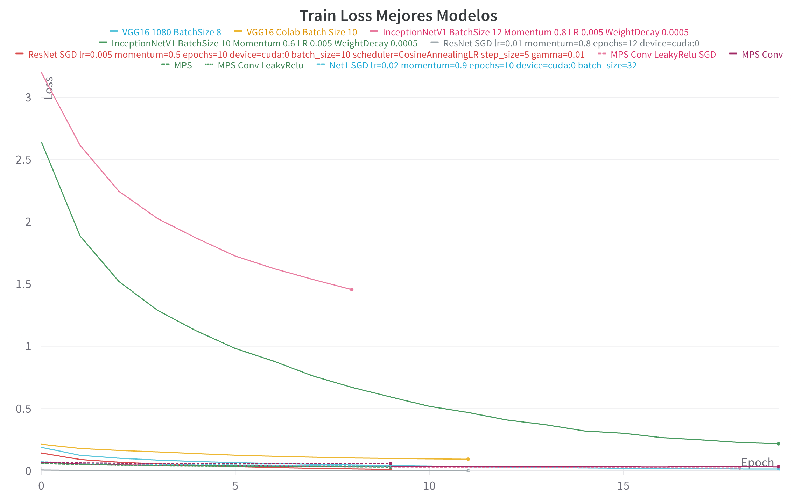

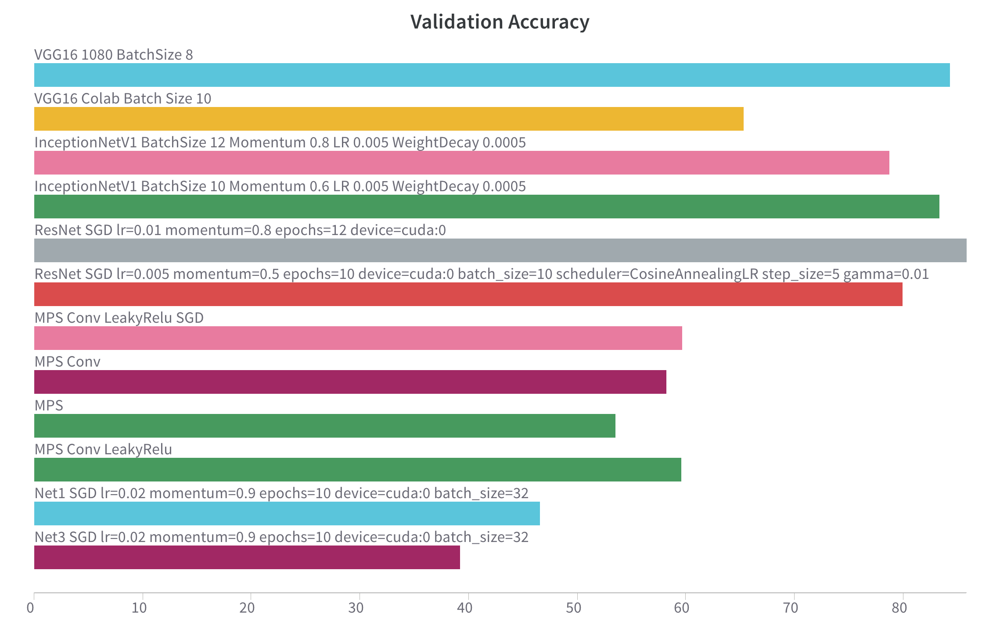
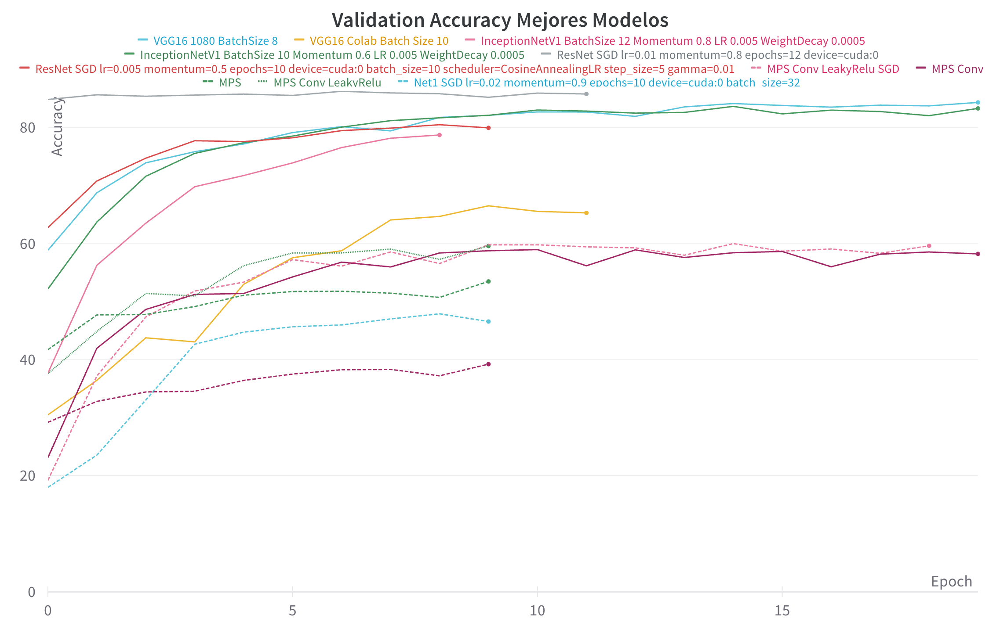
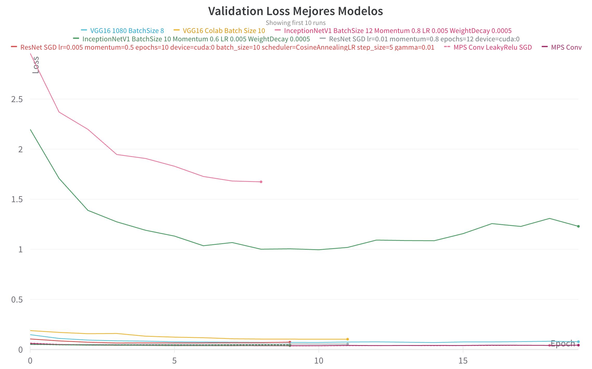

El mejor modelo resultó ser una ResNet entrenada en 12 epochs con Batch Size 10, con el optimizador SGD con Momentum 0.5 y Learning Rate 0.005, sin Weight Decay y sin Data Augmentation. Este modelo obtuvo una accuracy en validación de 85.81% al final de los epochs, pero obtuvo su pico de 86.27 % en validación en el Epoch 6.

Sobre los datos de test obtuvo lo siguiente:

```
    Accuracy of the network on the 10000 test test_images: 85 %
    Accuracy for class: plane is 89.6 %
    Accuracy for class: car is 93.8 %
    Accuracy for class: bird is 76.6 %
    Accuracy for class: cat is 70.1 %
    Accuracy for class: deer is 84.5 %
    Accuracy for class: dog is 77.2 %
    Accuracy for class: frog is 90.5 %
    Accuracy for class: horse is 88.9 %
    Accuracy for class: ship is 92.2 %
    Accuracy for class: truck is 90.5 %
```

### Otros resultados

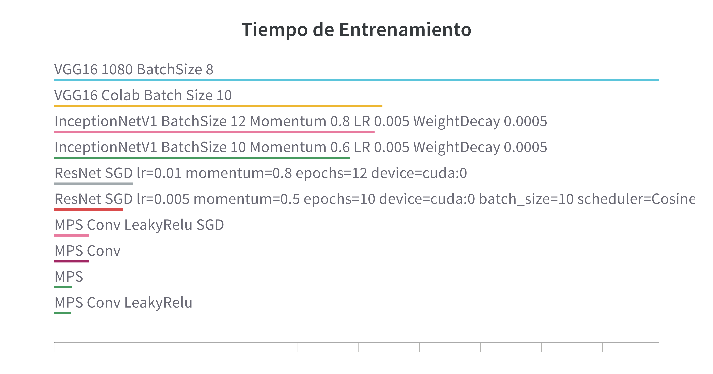
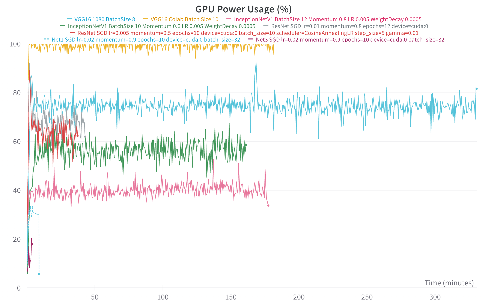
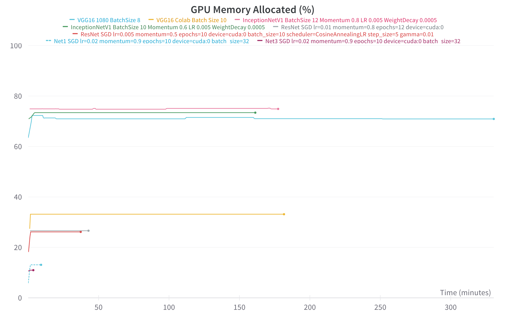

Los modelos VGG fueron los mas demandantes en tiempo de entrenamiento, y en consumo energético a lo largo de cada epoch, sin embargo los modelos InceptionNet fueron los que mas memoria de GPU consumieron. Por el otro lado, ademas de ser el modelo que mejor accuracy obtuvo, la ResNet fue, de los modelos mas complejos, el que menos tiempo de entrenamiento necesitó. Por esto ultimo y por su accuracy, la ResNet es el modelo que elegimos para hacer la busqueda de hiperparametros automatizada.

#### Busqueda de Hiperparametros

Para la ResNet con un ResidualBlock de `[2, 2, 2, 2]`, entrenamos por 5 epochs con un batch size de 10, hicimos grid search sobre el siguiente espacio de hiperparametros:

```
    learning_rates = [0.005, 0.001, 0.0005, 0.0001, 0.1]
    momentums = [0, 0.5, 0.9, 0.99]
```

Los mejores parametros que obtuvimos fueron los siguientes:

```
    {
        'learning_rate': 0.005,
        'momentum': 0.9,
        'batch_size': 10,
        'epochs': 5,
        'train accuracy' : 82.7625,
        'val_accuracy: 80.4,
        'train_loss': 0.05020029389774427,
        'val_loss': 0.056784901494160295
    }
```

Sin embargo, al entrenar por mas epochs no obtuvo mejor accuracy en validación que aquel que entrenamos a mano. 

### Conclusiones

En este trabajo práctico pudimos observar que las redes neuronales convolucionales son mucho mas eficientes para clasificar imagenes que las redes neuronales simples.

En cuanto a metodología, pudimos ver que el uso de Weights & Biases es muy útil para poder observar los resultados de los entrenamientos en tiempo real, y poder comparar los resultados de distintos modelos. En un momento dado quizas teníamos corriendo un modelo en la computadora de cada integrante del grupo, otro en Google Colab y otro en la computadora de escritorio y en W&B podíamos observar en tiempo real el progreso de los modelos. Aunque no implementamos Early Stopping programaticamente, al poder observar los resultados en tiempo real, pudimos identificar cuando un modelo comenzaba a sobreajustar y detener el entrenamiento en ese momento. A posteriori, los mejores resultados se obtuvieron con los modelos que se entrenaron por cerca de 10 epochs.

Para lograr mejores resultados que la modificación a mano del modelo base, lo que no nos mostraba mejora, decidimos investigar sobre diferentes arquitecturas de redes neuronales convolucionales. Inicialmente VGG e InceptionNet nos llamaron la atención para implementarlas, y luego pudimos comprender mejor su funcionamiento en clase. En particular, la ResNet fue la que mejor accuracy obtuvo, y la que menos tiempo de entrenamiento necesitó.

\newpage
\section{Anexo}

\includepdf[pages=1, pagecommand={\thispagestyle{plain}\subsection{Arquitectura Net1}}]{plots/Net1/graph.gv.pdf}
\includepdf[pages=1, pagecommand={\thispagestyle{plain}\subsection{\centering{Detalle Net1}}}]{plots/Net1/dot.gv.pdf}
\includepdf[pages=1, pagecommand={\thispagestyle{plain}\subsection{Arquitectura Net2}}]{plots/Net2/graph.gv.pdf}
\includepdf[pages=1, pagecommand={\thispagestyle{plain}\subsection{\centering{Detalle Net2}}}]{plots/Net2/dot.gv.pdf}
\includepdf[pages=1, pagecommand={\thispagestyle{plain}\subsection{Arquitectura Net3}}]{plots/Net3/graph.gv.pdf}
\includepdf[pages=1, pagecommand={\thispagestyle{plain}\subsection{\centering{Detalle Net3}}}]{plots/Net3/dot.gv.pdf}
\includepdf[pages=1, pagecommand={\thispagestyle{plain}\subsection{Arquitectura NetConv}}]{plots/NetConv/graph.gv.pdf}
\includepdf[pages=1, pagecommand={\thispagestyle{plain}\subsection{\centering{Detalle NetConv}}}]{plots/NetConv/dot.gv.pdf}
\includepdf[pages=1, pagecommand={\thispagestyle{plain}\subsection{Arquitectura VGG16}}]{plots/VGG16/graph.gv.pdf}
\includepdf[pages=1, pagecommand={\thispagestyle{plain}\subsection{\centering{Detalle VGG16}}}]{plots/VGG16/dot.gv.pdf}
\includepdf[pages=1, pagecommand={\thispagestyle{plain}\subsection{Arquitectura VGG19}}]{plots/VGG19/graph.gv.pdf}
\includepdf[pages=1, pagecommand={\thispagestyle{plain}\subsection{\centering{Detalle VGG19}}}]{plots/VGG19/dot.gv.pdf}
\includepdf[pages=1, pagecommand={\thispagestyle{plain}\subsection{Arquitectura InceptionNet}}]{plots/InceptionNetV1/graph.gv.pdf}
\includepdf[pages=1, pagecommand={\thispagestyle{plain}\subsection{\centering{Detalle InceptionNet}}}]{plots/InceptionNetV1/dot.gv.pdf}
\includepdf[pages=1, pagecommand={\thispagestyle{plain}\subsection{Arquitectura ResNet}}]{plots/ResNet/graph.gv.pdf}
\includepdf[pages=1, pagecommand={\thispagestyle{plain}\subsection{\centering{Detalle ResNet}}}]{plots/ResNet/dot.gv.pdf}

\newpage

\section{Bibliografía}
